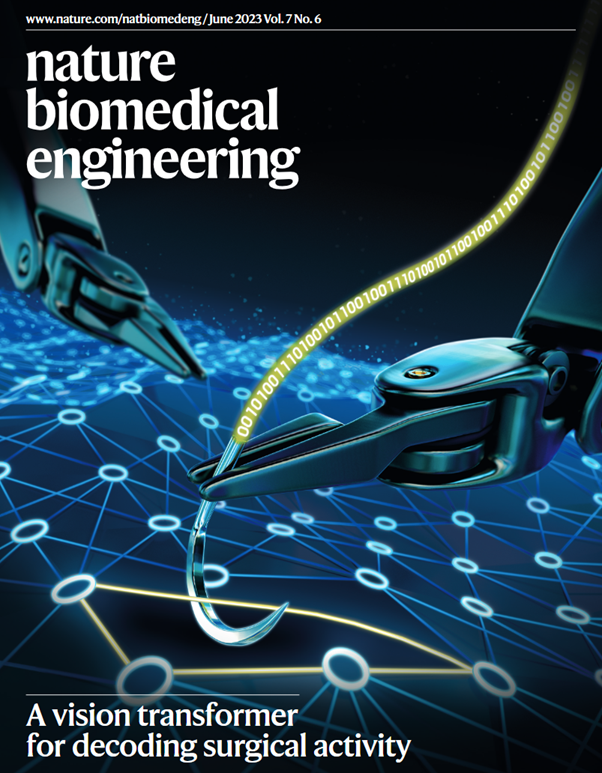

# SAIS
## A Vision Transformer for Decoding Surgery from Surgical Videos


[Journal Link](https://www.nature.com/articles/s41551-023-01010-8) | [Cite](#reference) 

**Abstract:** The intraoperative activity of a surgeon has substantial impact on postoperative outcomes. However, for most surgical procedures, the details of intraoperative surgical actions, which can vary widely, are not well understood. Here we report a machine learning system leveraging a vision transformer and supervised contrastive learning for the decoding of elements of intraoperative surgical activity from videos commonly collected during robotic surgeries. The system accurately identified surgical steps, actions performed by the surgeon, the quality of these actions and the relative contribution of individual video frames to the decoding of the actions. Through extensive testing on data from three different hospitals located in two different continents, we show that the system generalizes across videos, surgeons, hospitals and surgical procedures, and that it can provide information on surgical gestures and skills from unannotated videos. Decoding intraoperative activity via accurate machine learning systems could be used to provide surgeons with feedback on their operating skills, and may allow for the identification of optimal surgical behaviour and for the study of relationships between intraoperative factors and postoperative outcomes.

## What is SAIS?
SAIS is a model that decodes various elements of surgery from surgical videos. We show that SAIS achieves state-of-the-art performance in identifying surgical steps, distinguishing between surgical gestures, and assessing fine-grained surgical skills.

## Installation
First clone the repo and cd into the directory
```shell
git clone https://github.com/danikiyasseh/SAIS.git
cd SAIS
```
Then create a conda env and install the dependencies:
```shell
conda create -n SAIS python=3.9.7 -y
conda activate SAIS
pip install -r requirements.txt
pip install -e .
```

## Running inference
Please follow the steps below to perform inference with SAIS on a new surgical video.

### 1. Overview of repo layout
This is an overview of the initial repo layout. Note that the `videos` folder is initially empty. Place surgical videos to be processed in the `videos` folder, and ensure that each video has a unique name.

```
├── SAIS                      
│    ├── videos               # folder in which new surgical video is placed
│    │   ├── video_1.mp4                   
│    │   └── ...   
│    ├── scripts             
│    │   ├── run_experiments.py                   
│    │   └── ...   
│    ├── main.sh              # bash script to process new surgical video in an end-to-end manner
```

> Since this model was developed using PyTorch 1.8.0, the built-in transformers module did not inherently return the attention map. Our codebase does return the attention map and therefore requires we slightly modify the built-in transformers module. Specifically, the following steps must be taken in order to successfully run our code. 

#### 1a. Modifying built-in transformers module
- Navigate to the transformers module in your anaconda environment `anaconda3/envs/sais/lib/python3.9/site-packages/torch/nn/modules/transformer.py`
- On line 181, add `attn` as a second output of (a) the `mod` function and (b) the `forward` method
- On line 294, remove the `[0]` indexing and add `attn` as a second output of the (a) function and (b) the `forward` method

### 2. Downloading parameters of feature extractor
We extract features from surgical videos using [DINO](https://github.com/facebookresearch/dino/tree/main), a vision transformer pre-trained on natural images in a self-supervised manner. This requires downloading the pre-trained parameters from the original repo. Alternatively, you can download the parameters directly from this [link](https://dl.fbaipublicfiles.com/dino/dino_deitsmall16_pretrain/dino_deitsmall16_pretrain.pth).

> Place these downloaded parameters in the `outputs` folder as shown below. This is critical for the development of the model.

```
├── SAIS                      
│    ├── scripts             
│    │   ├── dino-main                  
│    │   │   ├── outputs
│    │   │   │   ├── dino_deitsmall16_pretrain.pth   # DINO parameters used for spatial feature extraction
```

### 3. Task-specific parameters of SAIS
SAIS was developed using surgical videos and human-provided annotations to achieve various tasks (e.g., gesture classification, skill assessment). After training SAIS, you will have access to its task-specific parameters which can subsequently be used for inference on a new surgical video. Note that because SAIS was trained using supervised contrastive learning, the parameters consist of `params.zip` which are the core architecture's learned parameters and `prototypes.zip` which are the learned parameters of the prototypes. Both are needed for inference.

> Place these downloaded parameters in the `params` folder as shown below. This is critical for inference. 

```
├── SAIS        
│    ├── scripts                           
│    ├── params             
│    │   ├── Fold_0                  
│    │   │   ├── params.zip		# parameters of the core architecture
│    │   │   ├── prototypes.zip	# parameters of the prototypes
│    │   └── ...   

```

### 4. Processing a surgical video
To perform inference on a new surgical video using a model previously trained on a specific task (e.g., gesture classification), you shouldn't need to modify any of the modules. Navigate to the root directory of the repo and run the following command.
```shell
bash ./SAIS/main.sh
```

### 5. Update to repo layout
Once you have processed the surgical video, you will notice that the repo now has additional folders and should have the following layout.
```
├── SAIS                      
│    ├── videos               
│    ├── scripts               
│    ├── main.sh
│    ├── ...   
│    ├── images	# new folder containing frames of surgical video
│    ├── flows		# new folder containing optical flow of surgical video
│    ├── paths		# new folder containing paths to frames and flows
│    ├── results	# new folder containing features extracted from frames and/or flows

```

## License and Terms of Use
This model and associated code are released under the CC-BY-NC-ND 4.0 license and may only be used for non-commercial, academic research purposes with proper attribution. Any commercial use, sale, or other monetization of the SAIS model and its derivatives, which include models trained on outputs from the SAIS model or datasets created from the SAIS model, is prohibited and requires prior approval. By downloading this model, you agree not to distribute, publish or reproduce a copy of the model. If another user within your organization wishes to use the SAIS model, they must register as an individual user and agree to comply with the terms of use. Users may not attempt to re-identify the deidentified data used to develop the underlying model.

## Reference
If you find our work useful in your research or if you use parts of this code please consider citing our [paper](https://www.nature.com/articles/s41551-023-01010-8):

Kiyasseh, D., Ma, R., Haque, T.F. et al. A vision transformer for decoding surgeon activity from surgical videos. Nat. Biomed. Eng 7, 780–796 (2023). https://doi.org/10.1038/s41551-023-01010-8

```
@article{Kiyasseh2023SAIS,
  title={A vision transformer for decoding surgeon activity from surgical videos},
  author={Kiyasseh, Dani and Ma, Runzhuo and Haque, Taseen F and Miles, Brian J and Wagner, Christian and Donoho, Daniel and Anandkumar, Anima and Hung, Andrew J},
  journal={Nature Biomedical Engineering},
  publisher={Nature Publishing Group},
  year={2023}
}
```

